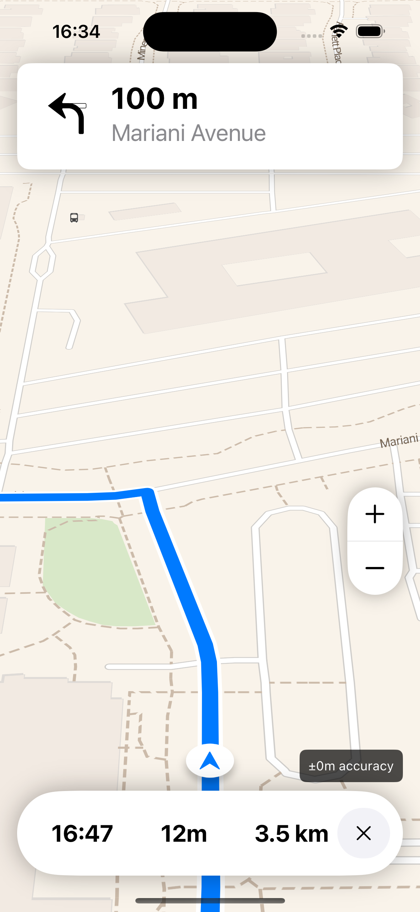

# Ferrostar

Ferrostar is a FOSS navigation SDK built from the ground up for the future.

[Why a new SDK?](https://stadiamaps.notion.site/Next-Gen-Navigation-SDK-f16f987bfa5a455296b0671636033cdb)

## Current status

The project is under active development
and the code is not yet ready for use in apps yet.
Many parts of the design are still in flux,
so there are no API stability guarantees.

That said, things are now in a solid alpha state on iOS,
and you can actually build a useful, if extremely rough,
proof of concept apps on iOS
You can track the road to something _usable_ in the
[Proof of Concept Milestone](https://github.com/stadiamaps/ferrostar/milestone/1).

We are focusing on iterating on the design with iOS first,
and once we feel we have answered the important design questions,
we can translate the concepts to Android and iterate on the core in parallel.
Android has a theoretically working core, but no UI work has been done.

## Project Goals

- Modular (or one could even say hexagonal) architecture
- Highly extensible (routing backends, UI, etc.)
- Batteries included: Navigation UI should be usable out of the box for the most common use cases in iOS and Android native apps without much configuration
- Vendor-neutrality to allow collaboration among major industry players, hobbyists, and everyone in-between
- No telemetry out of the box. If a use case (ex: fleet management) requires telemetry, this can be added by the developer in their own code.

## Non-goals

- UI components for searching for addresses or building a trip (left to the app developers).
- Compatibility with ancient SDKs / API levels, except where it’s easy; this is a fresh start, so *we can and should leverage modern features and tools* as of 2023.
- Route generation will be handled separately; there are many good cloud vendors (like [Stadia Maps](https://stadiamaps.com/products/navigation-routing/)) as well as self-hosting / local generation options.
- A "free roam" experience without any specific route (though it *should* be possible to plug Ferrostar into such an experience).

## Project Design and Structure

See the [ARCHITECTURE](ARCHITECTURE.md) document.

## Getting Started

### As a Contributor

See our [CONTRIBUTING](CONTRIBUTING.md) guide for info on expectations and dev environment setup.

NOTE: The Android project will probably be broken for a few weeks, and you'll definitely want to be building with
`useLocalFramework = true` in Package.swift.

### As a User

TODO: Write this once we have something useful.

#### TODO: iOS

#### TODO: Android

## Platform Support Targets

### Rust

The project should always be developed using the latest stable Rust release. While we don't intend to use every new language features the day it lands,
there isn't any reason to lag behind the latest stable.

### Swift

The core requires Swift 5.9+, as we are iterating on a more ergonomic [wrapper](https://github.com/stadiamaps/maplibre-swiftui-dsl-playground)
for MapLibre Native in parallel,
and it leverages macros.

### iOS

We plan to start iOS support at version 16.
Our general policy will be to support the current and at least the previous major version,
extending to two major versions if possible.

### Android

Android developers should always build using the latest publicly available Android Studio version.
Android users are generally much slower to get new OS major versions due to a variety of factors, so
our Android support will initially stretch back to API level 29 (Android 10 / Q). This will similarly cover around 70%
of devices to start.

TODO: Long term, what is a reasonable Android support target? 90%?
