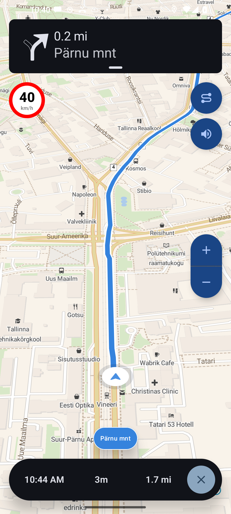

# Ferrostar

Ferrostar is a FOSS navigation SDK built from the ground up for the future.

## Getting Started

### As a User

Check out the [guide](https://stadiamaps.github.io/ferrostar/)!

### As a Contributor

See our [CONTRIBUTING](CONTRIBUTING.md) guide
for info on expectations and dev environment setup.

## Current status

The project is under active development, and is currently in **beta**.
It is already production-ready for certain use cases,
but there are still some rough edges and missing features.

Here's a quick breakdown of support by platform.

|  | iOS | Android | Web |
|---|---|---|---|
| Core library building | ✅ | ✅ | ✅ |
| High-level core bindings | ✅ | ✅ | 👨‍💻 |
| Simulated location provider | ✅ | ✅ | ✅ |
| Live location provider | ✅ | ✅ | ✅ |
| Composable UI - banners | ✅ | ✅ | ✅ |
| Composable UI - MapLibre integration | ✅ | ✅ | 👨‍💻 |
| Voice guidance (platform-native TTS) | ✅ | ✅ | ❌ |

The core is fully functional (pun intended for you FP lovers)
and complete enough to handle most use cases.
So if you're looking to roll a completely custom UI, you can start integrating today!

iOS and Android now have reasonably complete UIs,
but there are still some notable gaps and bugs
(open an issue or comment on existing ones if you're missing something)!
Multiple production app integrations are underway,
and the core developers are dogfooding in their own apps.

Join the `#ferrostar` channel on the [OSM US Slack](https://slack.openstreetmap.us/) for updates + discussion.
The core devs are active there and we're happy to answer questions / help you get started!

