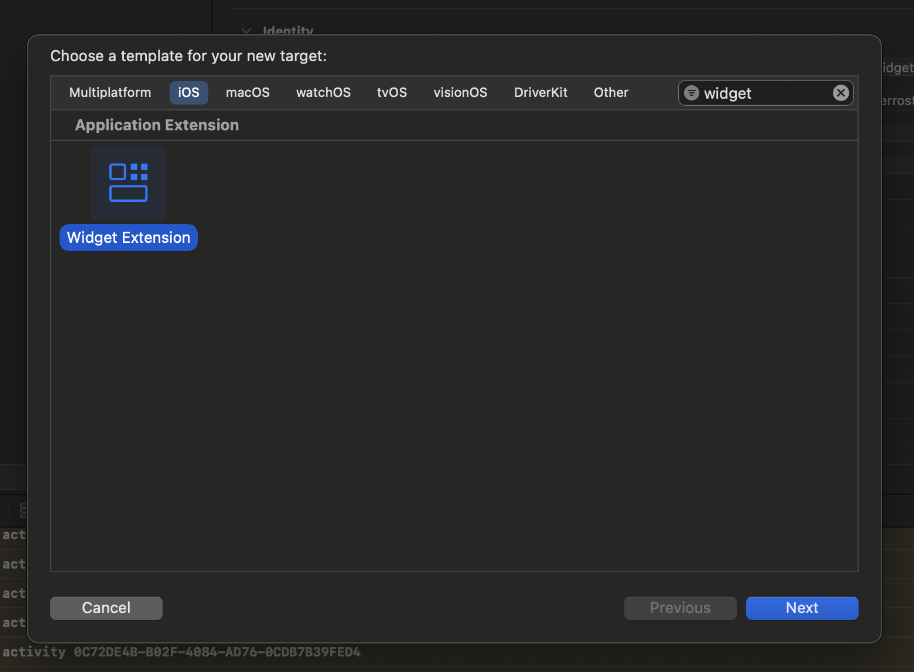

# Ferrostar Dynamic Island

A Ferrostar Dynamic Island is available in the `FerrostarSwiftUI` target, but requires setup
in the implementing app.

## Setup

To add the Ferrostar Dynamic Island, the following steps are required:

1. Add a new widget target to your project. Make sure when asked in the setup wizard, that you link it to your primary app target.



2. Add the FerrostarSwiftUI framework to the Widget project.
3. Register the Dynamic Island in the widget target.

```swift
FerrostarCore(
    ...,
    widgetProvider: FerrostarWidgetProvider()
)
```

4. Add the widget provider to `FerrostarWidget`.

```swift
import FerrostarSwiftUI
import SwiftUI
import WidgetKit

@main
struct Your_App_WidgetsBundle: WidgetBundle {
    var body: some Widget {
        // Other widgets can be registered here for other purposes.
        FerrostarWidget()
    }
}
```

## Customization

You can build your own Dynamic Island in one of two ways.

1. Building a custom `WidgetProvider` that implements it's own logic, `ActivityAttributes` model and widget.
2. Create a custom version of `FerrostarWidget` that uses the `ActivityConfiguration(for: TripActivityAttributes.self)`.
The fact you've registered one widget to the attributes model is what hooks it together.
