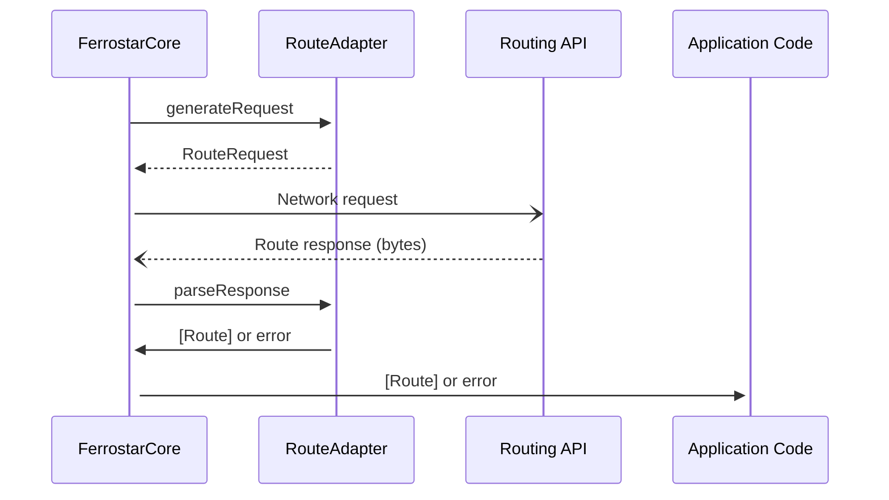
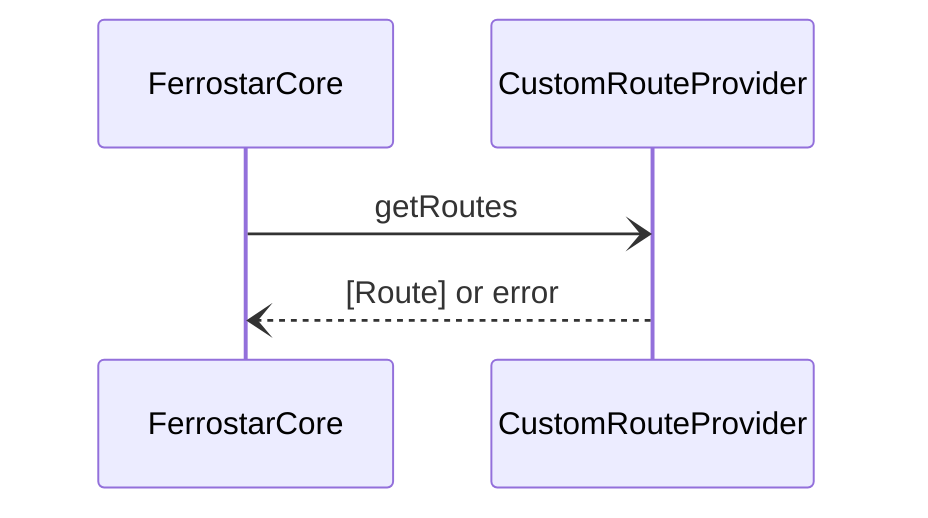
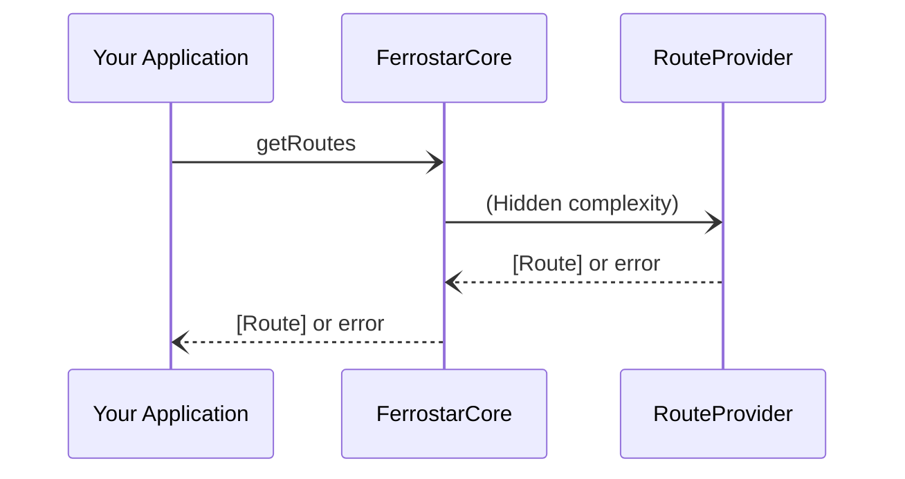

# Route Providers

Route providers expose common interfaces for making requests to a routing engine
and getting the data back in a standardized format for navigation.
This layer of indirection makes Ferrostar extremely extensible.

## `RouteProvider`

There are two types of route providers:
one more suited to HTTP servers,
and another designed for other use cases like local route generation.
The core ships with common implementations,
but you’re free to define your own *in your application code*
without waiting for a PR to land or running a custom fork!

### Route Adapters

A route adapter is the first class of route provider.
It is designed for HTTP, sockets, and other request/response flows.
A `RouteAdapter` is *typically* nothing more than the composition of two halves:
a `RouteRequestGenerator` and a `RouteResponseParser`
(both of which are traits at the Rust level;
protocols and interfaces at the platform level).
You can mix and match these freely
(though it probably goes without saying that you won’t get very far
swapping out the wrong parser for a server type).

Let’s illustrate why this architecture is nice with an example.
[Valhalla](https://github.com/valhalla/valhalla)
can generate responses in multiple formats.
The default is its own JSON format,
but it also has more compact Protobuf and (much) more verbose OSRM serializers.

The OSRM serializer is the one that’s typically used for navigation use cases,
so with a single `RouteResponseParser` implementation,
we can parse responses from a Valhalla server or an OSRM server!
In fact, we can also parse responses from the Mapbox Directions API too!
Both Valhalla and Mapbox have OSRM serializers that add a few extra fields
which are useful for navigation applications.
The OSRM parser in the core of Ferrostar handles all of these “flavors” gracefully.

OSRM parser in hand, all that we need to do to support these different APIs
is a `RouteRequestGenerator` for each.
All three speak HTTP, but they have different request formats.
Writing a `RouteRequestGenerator` is pretty easy though.
Request generators return a sum type (enum/sealed class)
indicating the type of request to make (only HTTP POST is supported at this time)
and associated data like the URL, headers, and request body.

Here’s a sequence diagram illustrating the flow of data between components.
Don’t worry too much about the internal complexity;
you’ll only interface with `FerrostarCore` at the boundary.

#### Bundled support

The Ferrostar crate includes support for the following out of the box.

##### Valhalla

Valhalla APIs are supported out of the box with full request and response parsing.

As a bundled provider, `FerrostarCore` in the platform layer exposes
convenience initializers which automatically configure the `RouteAdapter`.

If you’re rolling your own integration or curious about implementation details,
the relevant Rust type is `ValhallaHttpRequestGenerator`.

For response parsing, we use the OSRM format at this time.
You can construct an instance of `ValhallaHttpRequestGenerator` directly
(if you’re using Rust for your application)
or using the convenience method `createValhallaRequestGenerator`
from Swift or Kotlin.

##### OSRM

OSRM has become something of a de facto *linga franca* for navigation APIs.
Ferrostar comes bundled with support for decoding OSRM responses,
including the common extensions developed by Mapbox and offered by many Valhalla servers.
This gives drop-in compatibility with a wide variety of backend APIs,
including the hosted options from Stadia Maps and Mapbox,
as well as many self-hosted servers.

The relevant Rust type is `OsrmResponseParser`.
The autogenerated FFI bindings expose a `createOsrmResponseParser` method
in case you want to roll your own `RouteAdapter` for an API
that uses a different request format but returns OSRM format responses.

#### Implementing your own

If you’re working with a routing engine
that you think would be useful to others,
we welcome PRs!
Have a look at the existing Valhalla (request generator)
and OSRM (response parser) implementations.

If you’re dealing with servers+formats which make sense to upstream,
you can implement your own in Swift or Kotlin.
Just implement/conform to one or both of
`RouteRequestGenerator` and `RouteResponseParser`
in your Swift and Kotlin code,
depending on which parts are proprietary.

### `CustomRouteProvider`

Custom route providers are most commonly used for local route generation,
but they can be used for just about anything.
Rather than imposing a clean (but rigid) request+response model
with opinionated use cases like HTTP in mind,
the custom route provider is just a single-method interface
(SAM for you Java or Kotlin devs)
for getting routes asynchronously.

Here’s a sequence diagram illustrating the flow of data between components
when using a `CustomRouteProvider`.

## Using a `RouteProvider`

The parts of Ferrostar concerned with routing are managed
by the `FerrostarCore` class in the platform layer.
After you create a `RouteProvider` and pass it off to `FerrostarCore`
(or use a convenience constructor which does it all for you!),
you’re done.
Developers do not need to interact with the `RouteProvider` after construction.
`FerrostarCore` provides a high-level interface for getting routes,
which is as close as you usually get to them.

This part of the platform layer follows the
[Hollywood principle](https://en.wiktionary.org/wiki/Hollywood_principle).
This provides elegant ways of configuring rerouting, which we’ll cover next.